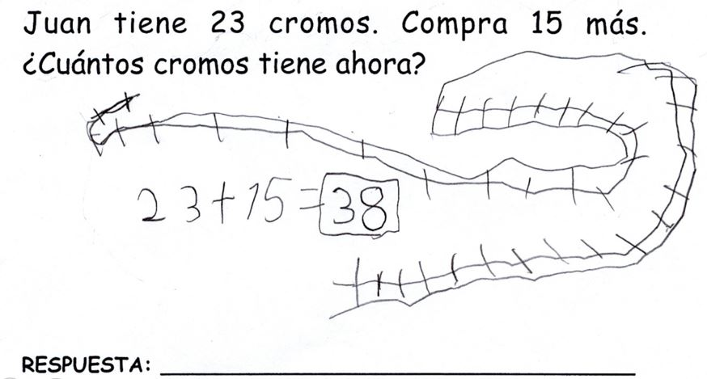
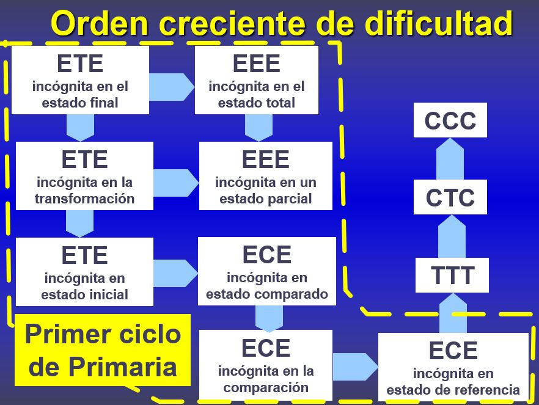
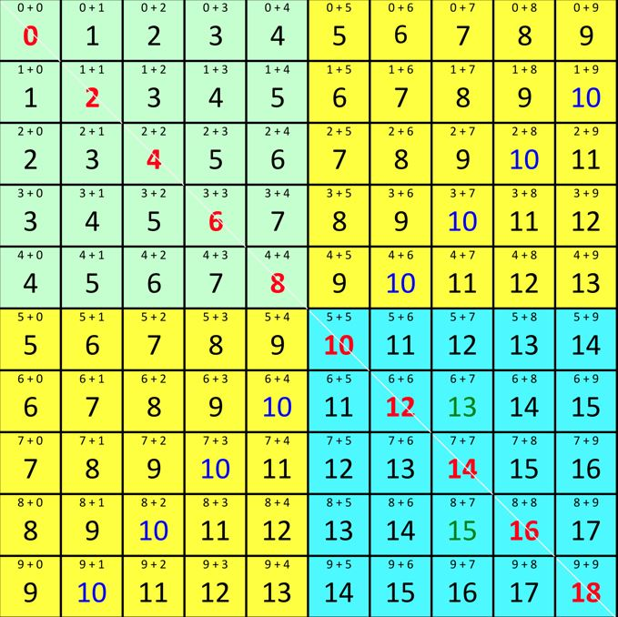
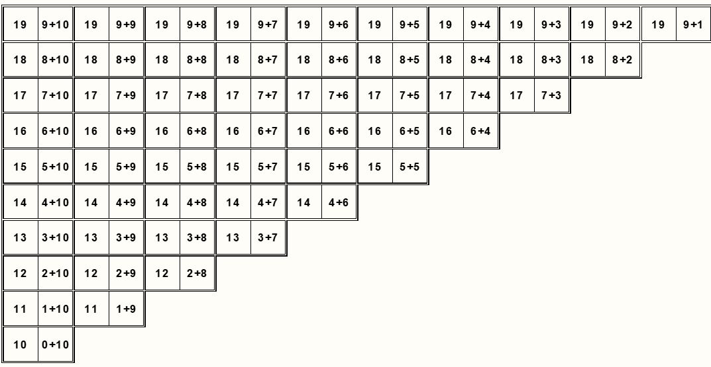
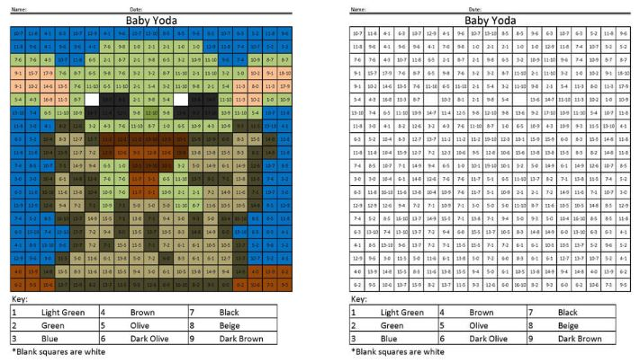
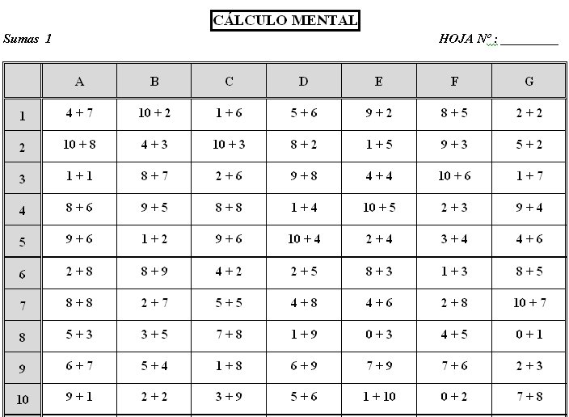
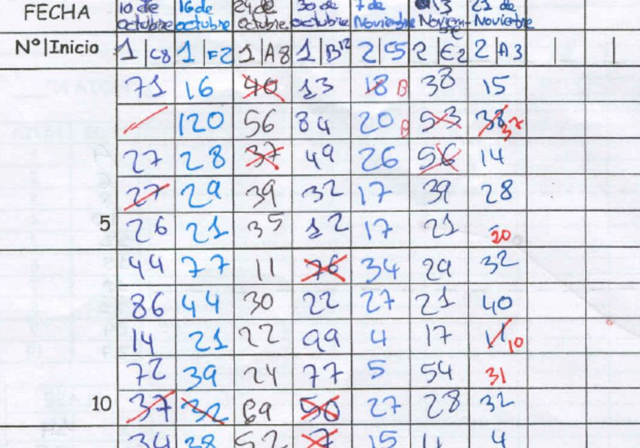
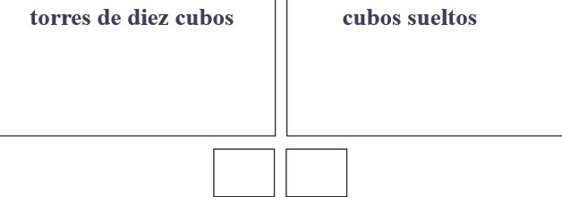
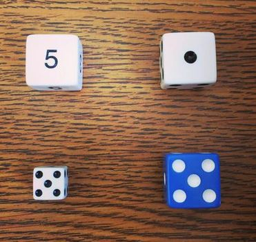

# Acceso a la presentación {data-background-image="assets/art/pc.jpg" data-background-opacity="0.25"}

## {data-background-image="assets/art/pc.jpg" data-background-opacity="0.18"}

{width=50%}

[https://pbeltran.github.io/mates-con-significado-ene2020](http://pbeltran.github.io/mates-con-significado-ene2020)

# Pongamos las cartas sobre la mesa {data-background-image="assets/art/belinda-fewings-unsplash.jpg" data-background-opacity="0.25"}

## Sobre el algoritmo de la suma y lo que pasa por correr

Niño de 7 años. 

- ¿900+400?
- 13 y dos ceros.
- ¿Ein?
- ¿Trece mil? 

. . .

Pues eso pasa por correr :running: :running: :running:

. . .

Desarrollado aquí :point_down:

[https://twitter.com/pbeltranp/status/1180914145509679104](https://twitter.com/pbeltranp/status/1180914145509679104)

## Un problema

> Si tienes 7 fichas rojas y 9 azules, ¿cuántas fichas tienes en total?

. . .

¿Hace falta saber sumar para resolverlo?

## Doble vía {data-background-image="assets/images/toby-christopher-LiMP8mmZbLQ-unsplash.jpg" data-background-opacity="0.18"}

:::::::::::::: {.columns}

::: {.column width="45%"}

> Situaciones didácticas aditivo-concretas

$\downarrow$

Resolución de problemas aritméticos.

:::

::: {.column width="45%"}

> Situaciones didácticas aditivo-formales 

$\downarrow$

Memorización de tablas y otros hechos aritméticos, adquirir técnicas de cálculo oral y, **después**, escritas.

:::
:::::::::::::

## Tipos de situaciones aditivas

> Son problemas o situaciones que se pueden resolver con una suma o con una resta.

{ width=80% }

## Tipos de situaciones aditivas

## Tipos de problemas

Un  problema aditivo de una etapa consta de tres cantidades: 

- Dos datos numéricos.
- Una incógnita (la solución del problema), que se obtiene sumando o restando los dos datos.

. . .

Tanto los datos como la incógnita pueden tener significado de: 

- **Transformación**, cuando mide la transformación (aumento o disminución) que sufre una cantidad inicial.
- **Comparación**, cuando expresa la comparación (mayor que o menor que) entre dos cantidades. 
- **Estado**, cuando es una cantidad que no transforma ni compara otras cantidades.

## ¿Dónde está la dificultad?

En una floristería hay 315 rosas y 205 claveles, ¿cuántas flores hay?

. . .

Sara tiene 47 caramelos más que Laura y Laura tiene 83 caramelos menos que Alberto. ¿Cuántos caramelos tiene de más o de menos Sara que Alberto?

## ¿Dónde está la dificultad?

- Estructura semántica.
- Tamaño de los datos.
- Grado de contextualización.

## Gradación de situaciones aditivas

{ width=80% }

# Aprendizaje de los hechos numéricos (tablas) {data-background-image="assets/art/kidwriting.jpg" data-background-opacity="0.18"}

## Cálculo oral

{ width=60% }

## Juegos tipo dominó 

{ width=90% }

Fuente: Rafael Escolano. _Refuerzo de aritmética en el CEIP Recarte y Ornat._

## Coloreables

Casi más recomendables como refuerzo para casa.

{ width=85% }

[https://www.coloringsquared.com/](https://www.coloringsquared.com/)

## Hojas de cálculo mental

:::::::::::::: {.columns}

::: {.column width="45%"}
{ width=100% }
:::

::: {.column width="45%"}
{ width=100% }

:::
:::::::::::::

Son con tiempo, pero es fundamental crear un clima tranquilo y de confianza, centrado en la mejora de cada uno. 

[http://docentes.educacion.navarra.es/jjimenei/index.html](http://docentes.educacion.navarra.es/jjimenei/index.html)

# Lectura y escritura de números de dos cifras {data-background-image="assets/art/abacus.jpg" data-background-opacity="0.18"}

## Sistema de numeración decimal posicional

¿Sabemos contar?

{ width=70% }

Para saber más de esta actividad (ESO): [https://twitter.com/pbeltranp/status/1193117005500555264](https://twitter.com/pbeltranp/status/1193117005500555264)

## Ideas fundamentales de nuestro SND

- Se utilizan diez símbolos (cifras).
- Se realizan agrupamientos sucesivos de 10 en 10.
- La posición que ocupa cada cifra tiene un significado preciso.

. . .

¿Qué cifra vale _más_?

$121$

## Situaciones de lectura y de escritura

> Conocimientos previos

- Contar de uno en uno, de diez en diez.
- Interpretar como cardinales las palabras numéricas correspondientes a los números de dos cifras. 
- Realizar tareas de agrupamiento en una colección de elementos según un número dado.
- Manejar el ábaco y las plaquetas para representar números de dos cifras.
- Sumar oralmente de diez en diez y decenas con unidades.
- Leer y escribir las **cifras**.

## Situaciones de lectura y de escritura

:::::::::::::: {.columns}

::: {.column width="45%"}

> Escritura

Veintiocho 

$\downarrow$

Acciones con el material (manipulación)

$\downarrow$

28
:::

::: {.column width="45%"}

> Lectura

28 

$\downarrow$

Acciones con el material (manipulación)

$\downarrow$

Veintiocho

:::
:::::::::::::

## ¿Cómo podemos trabajar estas situaciones?

> Diversos materiales manipulables

Policubos

Ábaco horizontal

Plaquetas de Herbinière-Lebert

## Policubos

{ width=65% }

## Lectura y escritura con policubos {data-background-image="assets/images/policubos.jpg" data-background-opacity="0.24"}

>Debéis ir a la caja de los cubos y coger veinticuatro cubos que llevaréis a vuestra mesa. Después tenéis que construir todas las torres de diez cubos que podáis”. 

Una vez realizada la tarea el profesor les da un papel para que dibujen las torres y los cubos que han quedado sueltos y escriban debajo el número de torres y el de cubos. 

{ width=65% }

## Lectura y escritura con policubos (variantes) {data-background-image="assets/images/policubos.jpg" data-background-opacity="0.24"}

Supongamos que en la clase hay una caja con cubos sueltos y otra con torres de diez cubos. ¿Qué distintas estrategias pueden aparecer si se pide que cojan treinta y dos cubos? 

> ¿De qué conocimientos matemáticos depende el que cojan directamente las torres ya hechas? 

## El ábaco horizontal (aditivo) {data-background-image="assets/art/abacus.jpg" data-background-opacity="0.18"}

{ width=65% }

## El ábaco horizontal (aditivo) {data-background-image="assets/art/abacus.jpg" data-background-opacity="0.18"}

:::::::::::::: {.columns}

::: {.column width="45%"}

Ábaco horizontal sin base auxiliar

{ width=90% }

:::

::: {.column width="45%"}

Ábaco horizontal con base auxiliar

{ width=90% }

:::
:::::::::::::

## El ábaco horizontal (aditivo) {data-background-image="assets/art/abacus.jpg" data-background-opacity="0.18"}

El ábaco horizontal, empleado de manera aditiva, es un material didáctico estructurado muy valioso para: 

- Trabajar las situaciones de cardinalidad con recuento. Es decir, reforzar la técnica de conteo de los alumnos de 1º.
- Asociar recitado con cantidad.
- Comprender el SND hasta el 100.
- Articular las situaciones de agrupamiento decimal con las de escritura de números de dos cifras.
- Aprender, desde la comprensión, la tabla de la suma (hechos numéricos).

## Vídeos sobre el uso del ábaco {data-background-image="assets/art/abacus.jpg" data-background-opacity="0.18"}

[Niño empleando el ábaco horizontal](https://www.youtube.com/watch?v=I3DEmwqZTn4)

[Niña empleando el ábaco horizontal](https://www.youtube.com/watch?v=t0ekmsC6ZII)

## Plaquetas de Herbinière-Lebert

{ width=45% }

Numicon (no deja de ser una _versión comercial_ de las plaquetas) :point_down:

{ width=35% }

## Unas preguntas sobre el cero... 

:question: :question: :question:

> ¿Un alumno puede contar objetos de 10 en 10 sin conocer el cero?

. . .

:::::::::::::: {.columns}

::: {.column width="45%"}

{ width=90% }

:::

::: {.column width="45%"}

{ width=90% }

:::
:::::::::::::

¿Las personas que construyeron esto conocían el cero?

## Unas preguntas sobre el cero... 

:question: :question: :question:

> ¿Se puede comenzar la lectura y escritura de los números sin haber hablado del cero? 

. . .

Sí. Es más sencillo justificar la escritura del 27 que la del 20. 

## Unas preguntas sobre el cero... 

:question: :question: :question:

> ¿En qué momento se debería introducir la escritura de las decenas completas: diez, veinte, treinta, ...? 

. . .

Cuando el alumnado sepa escribir razonablemente bien números sin ceros, se plantea veinte, treinta, etc. Por último, se plantea la escritura y lectura del 10, el más difícil de entender.

# Enseñanza de los algoritmos de las operaciones {data-background-image="assets/art/kidwriting.jpg" data-background-opacity="0.18"}

## Problemática con los algoritmos

## Sobre los algoritmos

- ¿Es más fácil el algoritmo escrito de la suma que el cálculo oral?
- Están basados en reglas que son poco intuitivas para el alumnado, basadas en propiedades del sistema de numeración decimal.
- Son reglas difíciles de justificar.
- Necesitan realizar un esfuerzo importante de memorización.
- Han perdido su utilidad, porque hay otras formas de calcular.

> Repensemos el papel que han de jugar en el aprendizaje

## Problemática con los algoritmos

- Los alumnos deberían comprender y saber justificar las reglas del algoritmo.
- Así facilitamos la memorización de las reglas y se minimizan los errores. 
- Es importante que el alumnado sepa utilizar otras técnicas de cálculo:
	- Cálculo mental.
	- Calculadora. 

# Actividades abiertas {data-background-image="assets/art/belinda-fewings-unsplash.jpg" data-background-opacity="0.25"}

## 

{ width=64% }
	
[http://wodb.ca/](http://wodb.ca/)
	
# Temas que nos dejamos en el tintero {data-background-image="assets/art/class.jpg" data-background-opacity="0.18"}

## Las matemáticas en primaria no son solo aritmética

- La medida. 
- La geometría.
- Probabilidad y estadística.

## Los manipulables pueden usarse bien, mal o regular

## Visión de las matemáticas {data-background-image="assets/art/clase.jpg" data-background-opacity="0.1"}

- El proceso de enseñanza y aprendizaje puede verse como una negociación de significados. 
	- Significado personal.
	- Significado de referencia, institucional. 

>¿Qué visión de las matemáticas queremos transmitir?

## Enseñanza de las matemáticas {data-background-image="assets/art/clase.jpg" data-background-opacity="0.1"}

Hay un consenso en que la resolución de problemas debería ser el eje central de la enseñanza y el aprendizaje de las matemáticas. Acerca de ello, hay que considerar tres perspectivas:

::: incremental

- Enseñar **para** resolver problemas. 
- Enseñar **a través** de la resolución de problemas. 
- Enseñar **sobre** resolución de problemas. 

:::

. . .

Para indagar un poquito sobre esto: [Gaulin \(2001\)](http://www.hezkuntza.ejgv.euskadi.eus/r43-573/es/contenidos/informacion/dia6_sigma/es_sigma/adjuntos/sigma_19/7_Tendencias_Actuales.pdf)

## A través de la resolución de problemas {data-background-image="assets/art/clase.jpg" data-background-opacity="0.1"}

>¿El objetivo general de usar la RP en el aula de matemáticas debería ser enseñar la RP per se, o enseñar contenido matemático, usando la RP como vehículo? 

:::incremental
- Autores como Anderson (2014) atribuyen el bajo desempeño en RP de los estudiantes al tratamiento _tradicional_ de la RP en el aula, independiente y aislado del desarrollo de ideas, procesos y conceptos matemáticos básicos. 
- La RP a menudo toma la forma de problemas de aplicación al final de cada lección, presumiblemente para promover la capacidad de **aplicar** lo aprendido. Así no se cumple el propósito de enseñar a resolver problemas o desarrollar o profundizar en los contenidos. 
:::

# Créditos y referencias {data-background-image="assets/art/credits.jpg" data-background-opacity="0.1"} 

## Referencias

Básicamente, lo que vienen a contar estas diapositivas es la propuesta que se trabaja en las asignaturas de **Didáctica de la Matemática** en la Facultad de Educación de la Universidad de Zaragoza: 

:books: Área de Didáctica de la Matemática, Universidad de Zaragoza. Apuntes de _Didáctica de la Aritmética I_, _Didáctica de la Aritmética II_ y _Didáctica de la Geometría_.

:small_blue_diamond: :small_blue_diamond: :small_blue_diamond: :small_blue_diamond: :small_blue_diamond: :small_blue_diamond:

Merecen la pena las monografías de la UGR:

:books: Proyecto Edumat-Maestros. _Matemáticas y su Didáctica para Maestros._  Dirección y edición: Juan D. Godino. [Enlace](https://www.ugr.es/~jgodino/edumat-maestros/)

## Créditos {data-background-image="assets/art/credits.jpg" data-background-opacity="0.1"}

_Compartir el conocimiento de forma libre es una buena práctica._

En estas diapositivas se han utilizado materiales disponibles en abierto y se han citado las fuentes correspondientes. El contenido de la presentación está publicado con licencia Creative Common [CC-BY-SA-4.0](https://creativecommons.org/licenses/by-sa/4.0/legalcode.es), lo que quiere decir que puedes compartirla y adaptarla, citando al autor (Pablo Beltrán-Pellicer) y poniendo un enlace a [https://pbeltran.github.io/mates-con-significado-ene2020](http://pbeltran.github.io/mates-con-significado-ene2020)

_Siéntete libre de trabajar con este material y de contactar conmigo para compartir tus reflexiones._

## {data-background-image="assets/art/credits.jpg" data-background-opacity="0.1"}

Presentación realizada con  <a href="https://revealjs.com/#/">Reveal.js</a>, <a href="https://pandoc.org/">Pandoc</a>, <a href="https://www.mathjax.org/">MathJax</a> y <a href="https://www.markdownguide.org/">Markdown</a>. 

La fuente de las imágenes es propia, salvo las que se ha citado la fuente en su diapositiva y las de dominio público obtenidas en [Unsplash](https://unsplash.com).

